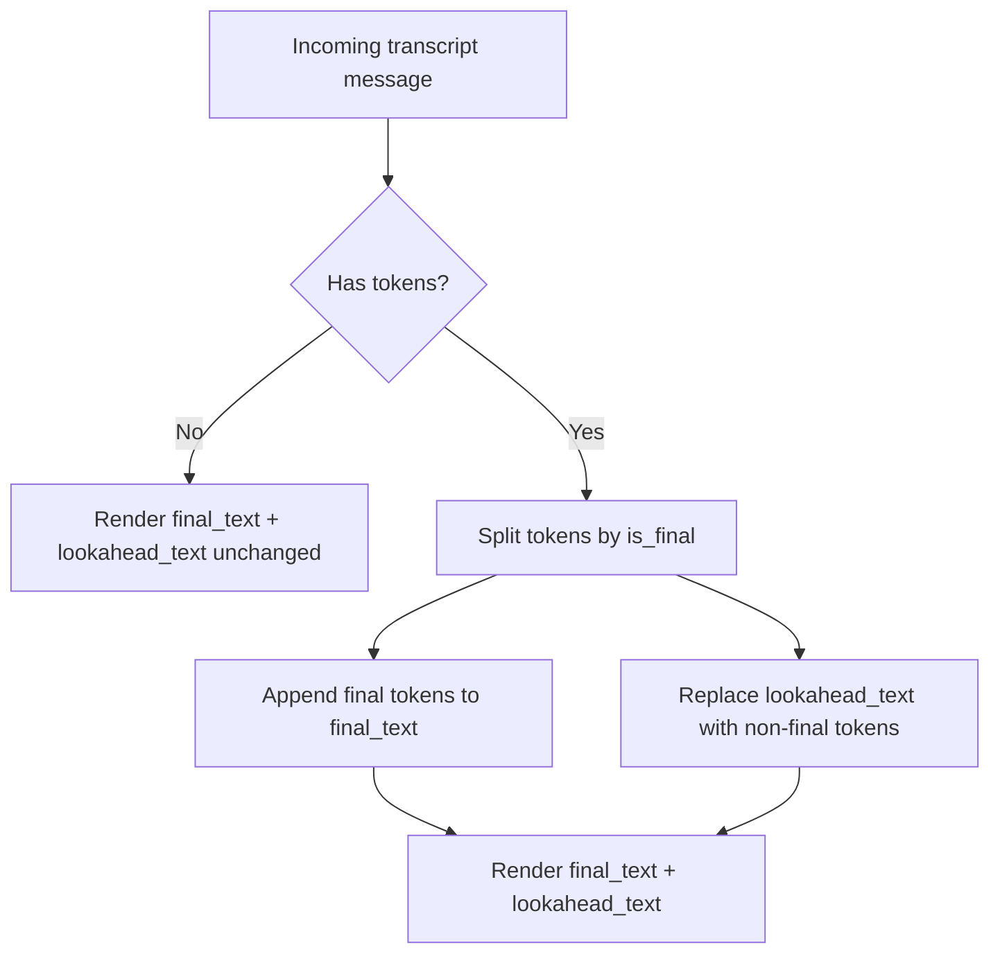

# WebSocket Proxy API (Draft)

This document describes the public WebSocket API exposed by the proxy server.

Related documentation:
- [`docs/proxy.md`](proxy.md) (proxy CLI options and env vars)
- [`docs/client.md`](client.md) (client CLI options and lexicon file format)
- [`docs/client-implementation.md`](client-implementation.md) (client integration guidance)

## Endpoints

- WebSocket: `ws://<host>:<port>/ws`
- Health:
  - `GET /health/live`
  - `GET /health/ready`
- Metrics (Prometheus text): `GET /metrics`

## TLS and Auth

- WSS is recommended. TLS may be terminated by a reverse proxy or configured in-process (TBD).
- Client auth is optional: when enabled (`--client-auth-mode api_key`), clients must pass the API key using one of:
  - `Authorization: Bearer <key>`
  - `Sec-WebSocket-Protocol: <key>`
  - `?api_key=<key>`
  By default, no auth is required.

## Connection Lifecycle

1) Client connects to `/ws`.
2) Client sends InitConfig JSON as the **first** message (text frame).
3) Client sends audio as binary WebSocket frames.
4) Server emits transcript events as JSON (partial/final).
5) Client sends an **empty binary frame** to signal end-of-stream.
6) Server sends `{ "finished": true }` then closes the WebSocket.

## InitConfig

### Schema (v1)

Required:
- `model: string`

Optional:
- `lexicon: { rewrite_terms: { source: string, target: string }[] }`
- `audio: object` (allowed but ignored in v1)

Notes:
- `lexicon.rewrite_terms` entries must include non-empty `source` and `target` strings.
- A second InitConfig message is a protocol error.

### Example

```json
{
  "model": "alpha",
  "lexicon": {
    "rewrite_terms": [
      { "source": "acme", "target": "ACME" }
    ]
  },
  "audio": { "format": "auto:0" }
}
```

## Transcript Events

### Schema (v1)

```json
{
  "track": "pnc",
  "tokens": [
    { "text": "final", "start_ms": 0, "end_ms": 120, "is_final": true },
    { "text": "partial", "start_ms": 120, "end_ms": 240, "is_final": false }
    
  ],
  "final_audio_proc_ms": 120,
  "total_audio_proc_ms": 280
}
```

Notes:
- A transcript message is emitted for every upstream payload, even if `tokens` is empty.
- `tokens` entries may include `nonspeech: true` for noise tokens.
- Lookahead tokens are represented with `is_final: false`.

## Final vs Non-Final Tokens (Rendering Guidance)

Plain-language meaning:
- **Final tokens** are confirmed words. Once you render them, they should stay forever.
- **Non-final tokens** (lookahead) are tentative. Render them only as a temporary overlay.
- When new final tokens arrive, append them to the permanent transcript and **clear** the non-final overlay.

Simple rendering rule:
1) Keep `final_text` (permanent).
2) Keep `lookahead_text` (temporary).
3) On each message:
   - append any `is_final=true` token text to `final_text`
   - replace `lookahead_text` with any `is_final=false` token text
4) Render as: `final_text + lookahead_text`

### Mermaid Diagram



## Finished Message

```json
{ "finished": true }
```

Sent after the client sends an empty binary frame. The server then closes the socket.

## Errors

### Error Schema

```json
{ "error_code": "...", "error_message": "..." }
```

The server closes the WebSocket after sending the error.

### Error Codes (v1)

- `invalid_init_config`
- `unsupported_feature`
- `unsupported_lexicon`
- `buffer_overflow` (used when upstream is not ready and audio arrives)
- `protocol_error`

## Backpressure and Buffering

v1 uses backpressure: if the upstream is not ready and an audio frame arrives, the server responds with `buffer_overflow` and closes.

## Compatibility

Compatible:
- binary audio frames
- empty binary frame end-of-stream
- partial/final transcript event flow

Different:
- InitConfig schema is custom (model/lexicon).

## Troubleshooting (Quick)

- `protocol_error`: InitConfig missing/late or extra text frames.
- `invalid_init_config`: required fields missing or invalid.
- `buffer_overflow`: upstream not ready; reduce chunk size or retry later.
